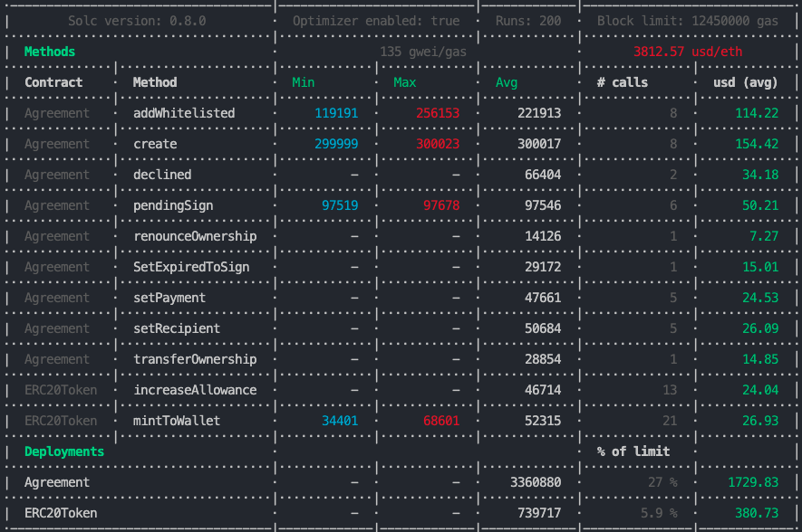

# Ignition Crowdsale

Before to Start
---
#### Validate Develop Environment
---
- Node v14.16.0 or +
- Solc v0.8.0 or +
- Hardhat v2.2.1 or +

#### For Testing
---
```
npx hardhat node
```
#### Start migration
---
```
truffle migrate --network development
```

#### Start truffle test
---
```
truffle test ./test/contracts/IgnitionMultipool.js  --network development
```

## environment variables (.env file)
---
MNEMONIC=
INFURAKEY=
TEST_OWNER=

### Last ETH Gas Reporter
---



### Last Contract Size Reporter
---


